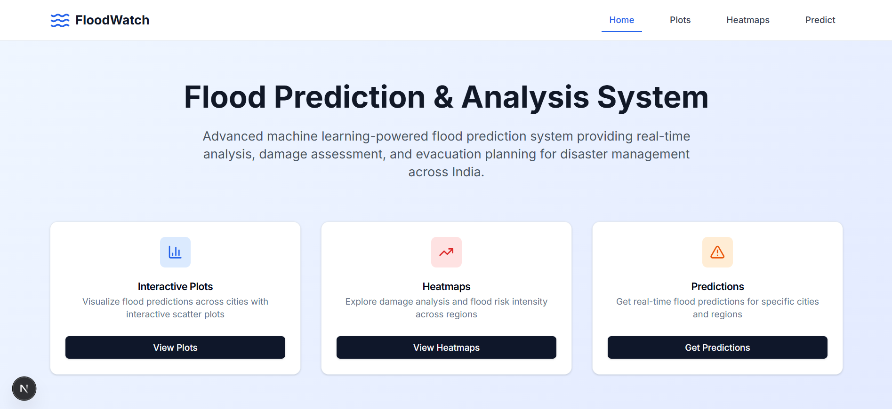
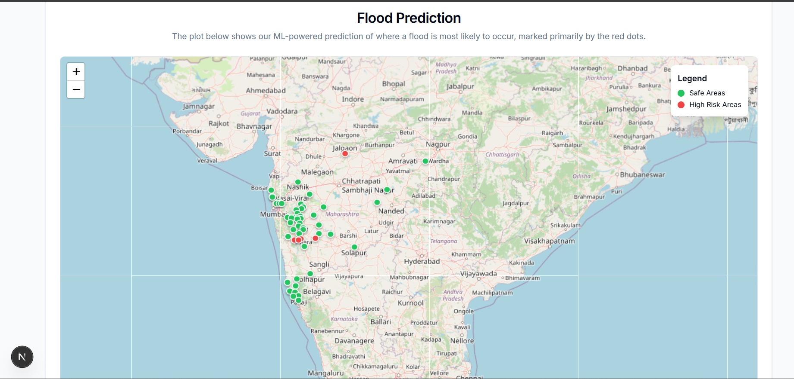
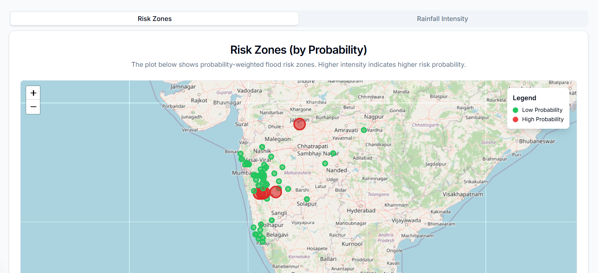
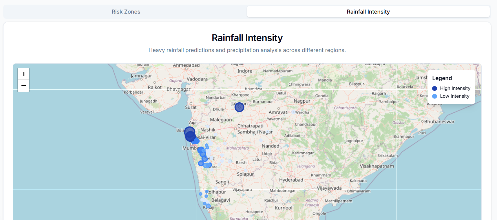

# FloodWatch - Machine Learning Flood Prediction System

A flood prediction and analysis system with a Flask backend and a Next.js frontend. The backend serves pre-generated 7‑day forecasts and analysis endpoints; the frontend provides maps, heatmaps, and city views.

## 🌟 Features

### Backend (Flask)
- **7‑day Forecast & Summaries**: Serves pre-generated forecasts and summaries
- **Data APIs**: Cities, risk zones, plotting data
- **Analysis APIs**: Overview and risk distribution
- **CORS enabled**

### Frontend (Next.js)
- **Interactive Maps** and **Heatmaps** for risk visualization
- **City/Date Forecast Views** powered by backend APIs
- **Modern UI** with Tailwind CSS

## 🚀 Quick Start

### Prerequisites
- Python 3.10+
- Node.js 18+ (LTS)

### 1. Clone the Repository
```bash
git clone <repository-url>
cd FloodML-master
```

### 2. Backend Setup

#### Install Python Dependencies
```bash
pip install -r FloodML-master/requirements.txt
```

#### Run the Backend
```bash
python FloodML-master/app/app.py
```
Backend runs at `http://localhost:5000`

### 3. Frontend Setup

#### Install Node.js Dependencies
```bash
cd frontend/floodguard
npm install
```

#### Run the Frontend
```bash
npm run dev
```
Frontend runs at `http://localhost:3000`

## 📁 Project Structure

```
FloodML-master/
├── FloodML-master/
│   ├── app/
│   │   ├── app.py                # Flask app factory and routes mount
│   │   ├── analysis_routes.py    # /api/analysis/*
│   │   ├── data_routes.py        # /api/data/*
│   │   ├── forecast_routes.py    # /api/forecast/*
│   │   └── data_loader.py        # Local CSV loaders/utilities
│   ├── data/                     # CSVs (forecasts, cities, etc.)
│   ├── requirements.txt          # Backend dependencies
│   └── training/                 # Training/evaluation utilities
└── frontend/
    └── floodguard/
        ├── app/                  # Next.js app directory
        │   ├── plots/            # Interactive plots
        │   ├── heatmaps/         # Heatmap visualizations
        │   ├── satellite/        # Satellite data
        │   └── page.tsx          # Homepage
        ├── components/           # React components
        ├── lib/api.ts            # Backend API client
        └── package.json          # Frontend scripts/deps
```

## 🔧 API Endpoints (Flask)

Base URL: `http://localhost:5000`

### Forecast
- `GET /api/forecast/7day` — Full 7‑day forecast dataset
- `GET /api/forecast/daily-summary` — Daily summary
- `GET /api/forecast/city-summary` — City-wise summary
- `GET /api/forecast/city/<city>` — Forecast for a city
- `GET /api/forecast/date/<YYYY-MM-DD>` — Forecast for a date

### Data
- `GET /api/data/cities` — Available cities
- `GET /api/data/plotting` — Map plotting dataset
- `GET /api/data/risk-zones` — Risk zone dataset
- `GET /api/data/dates` — Available dates

### Analysis
- `GET /api/analysis/overview`
- `GET /api/analysis/risk-distribution`

### Example API Usage
```bash
# Cities
curl http://localhost:5000/api/data/cities

# 7‑day forecast
curl http://localhost:5000/api/forecast/7day

# Forecast for a city
curl http://localhost:5000/api/forecast/city/Mumbai
```

## 🧠 Machine Learning Notes

- The API serves forecasts generated offline from training scripts in `FloodML-master/training/`.
- Training/evaluation notebooks are included at the repo root for reference.

## 🎨 Frontend Features

### Interactive Plots
- Map-based visualization of flood predictions
- Color-coded risk assessment (green = safe, red = high risk)
- Real-time data from backend APIs

### Heatmaps
- Damage analysis visualization
- Flood risk intensity mapping
- Rainfall intensity analysis

### Predictions Page
- City selection from 200+ Indian cities
- Real-time weather data display
- ML-powered flood risk assessment
- Detailed weather parameters

## 🔧 Configuration

- No external API keys are required to run the local backend.
- Default ports:
  - Backend: `5000`
  - Frontend: `3000`

## 🐛 Troubleshooting

- **CORS**: CORS is enabled in `FloodML-master/app/app.py`. Ensure backend is running before the frontend.
- **Missing deps**:
  - Backend: `pip install -r FloodML-master/requirements.txt`
  - Frontend: `npm install` in `frontend/floodguard/`
- **Port conflicts**: Ensure 5000 (backend) and 3000 (frontend) are free.
- **Health check**: `GET /api/health` returns server status and data file availability.

## 📊 Data

- CSV datasets are bundled under `FloodML-master/data/`.

## 🗺️ City Coverage

- Coverage focuses on Maharashtra with 50+ cities and towns.
- Source list: `FloodML-master/data/cities.csv` (city name with latitude/longitude).
- Example cities: Pune, Kolhapur, Nashik, Thane, Solapur, Satara, Ahmednagar, Jalgaon, Kalyan, Dombivli, Vasai, Virar, Ulhasnagar, Sangamner, Baramati, Wardha, Mahabaleshwar, Lonavala, Khandala, Talegaon, Shirur, Daund, Indapur, Kankavli, Kudal, Sawantwadi, Vengurla, Malvan, Devgad, Vaibhavwadi.
- Add or modify entries in `cities.csv` to extend coverage (frontend lists will reflect backend data endpoints).

## 🤝 Contributing

1. Fork the repository
2. Create a feature branch
3. Make your changes
4. Test thoroughly
5. Submit a pull request

## 📷 Screenshots

The following screenshots are available under `docs/screenshots/`.









---

**Note**: This is a research project. For critical decisions, verify with official sources.
